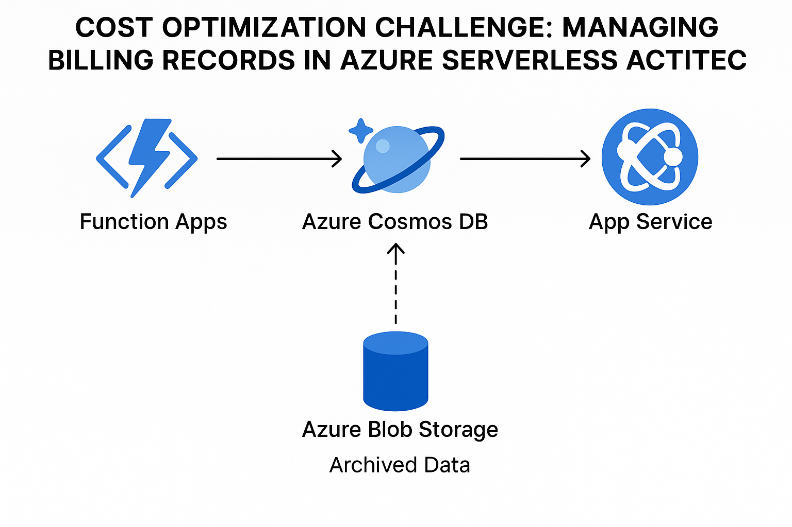

# Azure Billing Records Cost Optimizer

## 💡 Problem
Azure Cosmos DB is growing due to 2M+ billing records, most of which are older than 3 months. This leads to high storage and RU costs.

## ✅ Solution
- Archive records older than 3 months to Azure Blob Storage
- Use fallback logic in read API to serve from archive if needed
- No changes to existing APIs
- No downtime or data loss

## 🏗️ Architecture



## 🛠️ Components
- Azure Function App (API Layer)
- Azure Cosmos DB (Active Data ≤ 3 months)
- Azure Blob Storage (Archived Data > 3 months)
- Azure Durable Function (Scheduled Archival)

## 📂 Structure

```
azure-billing-cost-optimizer/
├── diagrams/
│   └── architecture.png
├── src/
│   └── archive_function/
│       ├── archival_function.py
│       └── read_logic.py
├── scripts/
│   └── deploy.sh
└── README.md
```

## 🚀 Getting Started

```bash
bash scripts/deploy.sh
```

Then deploy your Azure Function from `src/archive_function/` using VS Code.

## 📦 Archive Logic

- Daily/weekly Durable Function moves old records
- Records are saved as `.json` files in blob storage
- Cosmos DB cleaned post-archival

## 🔁 Read Logic

```python
try:
    cosmos_db.read(record_id)
except:
    blob.read(record_id.json)
```

---

## License
MIT
